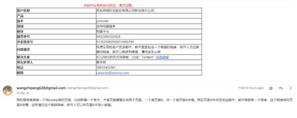

今日工作：

预览页面查看勾选框状态：

yya.getAllData().member_info_wzp_1735598586455916547[0]._selected

1.和总部老师请教邮箱跳转链接问题，因为必须保证会员也能登陆进youBIP的账号，才能进入单据详情。所以决定还是自己建Google
Form实现用户填写信息功能，邮件发送Google
Form链接。

2.正在配置第一个邮件，第二个邮件模板，编写发送邮件的前后端函数。

3.上午配合Thomas老师演示，计时

4.记录下演示过程中遇到的问题

5.打补丁，测试补丁mingwa_WK_0601SI、DO、SO等需求

6. 打补丁，测试补丁 mingwa_WK_0605_DO419
7. 打补丁，测试补丁 patch_20210910_KINO_采购发票支持参照赠品行
8. 打补丁，测试补丁 patch_20230605_采购发票去掉不能有多个来源单据的校验
9. 打补丁，测试补丁patch_20221121184417供应商导入银行账户不做校验
10. 打补丁，测试补丁 patch_20230602194023_mingwa_采购发票支持参照赠品行
11. 打补丁，测试补丁patch_mingwa_JM_SN412_20230605

明日展望：

继续配合Thomas老师演示，计时

现在需要想办法把Google
Form的数据导入到数据库

继续打补丁
