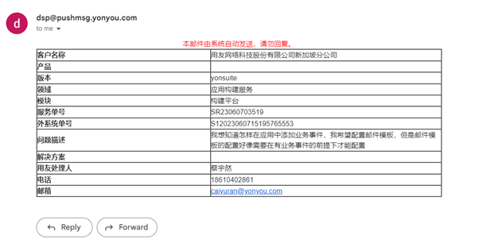

今日工作：

和总部老师请教邮箱模板配置问题，总部老师也不知道怎么弄，我和他在电话里研究了半天，后来加了微信也弄不出来。他说他回去研究一下。目前总部老师还没找到解决方案

配置好Google
Form。

把Google
Form的地址添加到发送的邮件中。

代码中添加了邮件发送状态的逻辑。

打补丁，测试补丁patch_20230606_采购订单采购发票提交和审批时校验模板的必填项

打补丁，测试补丁patch_20230606092633供应商银行账户允许字母

打补丁，测试补丁patch_20230606_修复so弃审修改重新保存审批后下游po表体被删的问题

打补丁，测试补丁patch_20230530_明华参照选择框总选不到的问题

打补丁，测试补丁patch_20230607081739不过滤费用类系列4

明日展望：

现在需要想办法把Google
Form的数据导入到数据库

等总部老师搞清楚怎么解决邮件模板配置问题，实在不行只能用html写模板的配置了

继续打补丁
