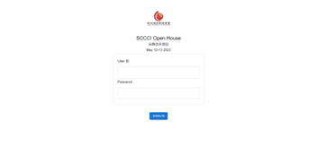
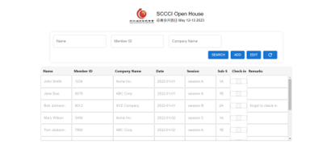
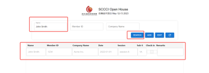

日志

测试mingwa_WK_0413_SI和PI提交校验上传附件、电邮导出模板附件名称调整

测试mingwa_WK_0413_电邮导出问题

测试patch_20230412215438PO复制清空主键

测试patch_20230412224822SO选择物料带出数量

测试patch_20230413165055SO选择物料默认数量

测试patch_mingwa_JM_SN175_LinkQuerySupplier

测试patch_20230413172603PUSHTOPO数量等于数量-可用量

在胡总指导下，大量修改，删减，调整任务清单

SCCCI完成PC端前端登陆界面代码

SCCCI完成PC端前端表格代码和搜索，新增，修改，更新逻辑

完成后端web用户登陆代码

完成后端筛选booking用户信息代码

之前写的被废弃的由用户发送邮件方案：

明日展望

继续完成SCCCI代码

继续测试
