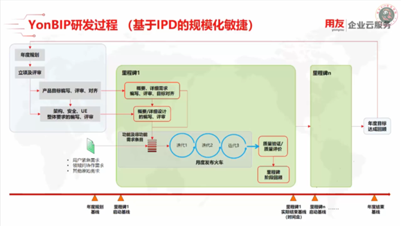
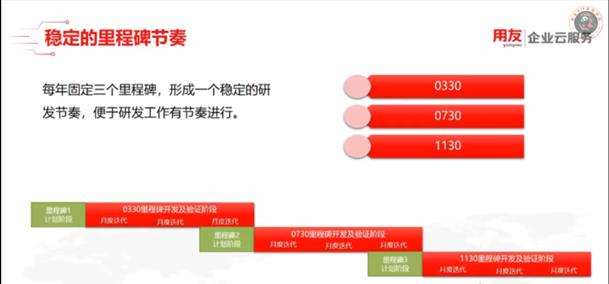
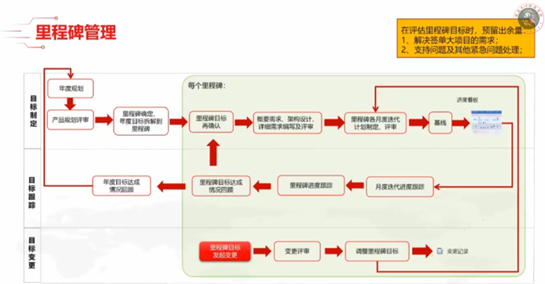
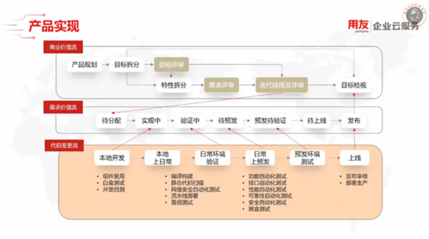
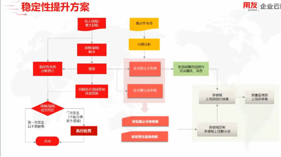

# 今日工作：

## 昨日课程遗留问题：

微服务中的限流，降级，熔断

在微服务架构中，由于服务之间的相互调用关系复杂，当出现异常情况或高并发访问时，会对系统的稳定性和可用性造成很大的影响。因此，限流、降级和熔断等机制就变得非常重要。

①  限流：限制服务的访问速率，防止过多的请求同时涌入系统导致系统崩溃。限流的方式通常有两种，一种是基于时间窗口的算法，另一种是基于令牌桶的算法。限流算法需要根据实际情况进行调整，以达到最优的效果。

②  降级：当系统出现异常或者负载过高时，可以通过降级来减轻系统负担，释放系统资源。降级可以采用多种方式，例如减少服务的功能、降低服务的质量、关闭不必要的服务等。但需要注意的是，在降级后，服务的功能和质量会受到影响，需要进行相应的监控和恢复。

③  熔断：在系统出现异常或者负载过高的情况下，熔断可以防止请求继续涌入系统，从而保护系统的可用性和稳定性。熔断通常是通过设置阈值来实现的，当某个服务的请求失败率达到一定的阈值时，系统会自动将该服务熔断，阻止后续的请求。熔断的恢复需要设置相应的时间窗口，待时间窗口过后，系统会尝试重新调用服务，如果调用成功，系统会逐渐恢复服务。如果调用失败，系统会继续熔断该服务。

## 和陈通淮老师，谭涛键老师开会：

1. 听他们介绍关于印尼本地化的方案，印尼
2. 了解一些基本概念，如：节点，语句，预置，开发
3. 和台湾同事连线，了解台湾本地化解决方案

## 友乐学课程：

### 2022集训

红皮书专项，知识库专项，应届生专项

### 用友产品体系总览

BIP, 云ERP

### YonBIP用友商业创新平台

新技术，社会化，实时，运营，数字化，智能化，数用分离

财务云，人力云，协同云（友空间），营销云（赚钱），采购云（花钱）

ERP核心：供应链和制造

### YonBIP研发过程

①IPD 是一种全面的软件开发方法，旨在通过集成各个阶段的过程和技术，从而在开发周期内提高效率、降低成本、改善质量。IPD 强调团队合作，注重在软件开发的不同阶段之间建立流畅的信息流和有效的沟通。

②敏捷开发是一种轻量级的软件开发方法，旨在提高开发效率、降低开发成本、改善软件质量。敏捷开发强调迭代和交付，强调与客户的密切合作，注重快速反馈和持续改进。敏捷开发的方法包括
Scrum、XP、Lean 等，它们共同构成了一套灵活、高效的软件开发过程。



里程碑：



里程碑详细流程：



产品实现：






### **开发人员重点关注**

开发子任务处理：Jira

缺陷修复：Jira

支持问题处理：Jira

## 阿里巴巴Java开发规范阅读（1p-10p）

1. 接口方法属性不加修饰符
2. Service 和 DAO 类：

* Service 类是业务逻辑层的抽象，负责处理业务逻辑，与用户交互，调用 DAO
  类进行数据持久化操作，从而完成业务需求。在软件架构中，Service
  层通常被用来处理复杂的业务逻辑，如事务处理、权限验证等。它们通常被设计为无状态的，也就是说它们不会存储数据，只负责对数据进行处理和转换。Service
  层的设计需要考虑代码的可重用性、可维护性和可测试性等方面。
* DAO 类（Data Access Object）是数据访问层的抽象，负责处理数据持久化操作，包括数据的增删改查等操作。DAO 类的主要作用是将业务逻辑与数据访问逻辑分离，使得业务逻辑层能够更加专注于处理业务逻辑。DAO 类的设计需要考虑数据访问的性能、安全性和可扩展性等方面。

3. 如果是形容能力的接口名称，取对应的形容词为接口名（通常是 –able 结尾的形容词）。
4. long或Long赋值时，数值后使用大写L，如2L,浮点数类型的数值后缀统一为大写的D或F,如175.5D, 150.3F
5. **不要使用一个常量类维护所有常量，要按常量功能进行归类，分开维护**
6. **左小括号和右边相邻字符之间不需要空格 **；右小括号和左边相邻字符之间也不需要空格 **；**而左大********括号前需要加空格
7. 采用4个空格缩进（除了C和Go空格看来都是推荐的缩进方式）
8. 单行字符数限制不超过120个
9. 单个方法的总行数不超过80行。
10. 静态方法变量直接用类名访问
11. 相同参数类型，相同业务含义，才可以使用的可变参数，参数类型避免定义为Object
12. 外部正在调用的接口或者二方库依赖的接口，不允许修改方法签名，避免对接口调用方产生影响。接口过时必须加@Deprecated注解，并清晰地说明采用的新接口或者新服务是什么。
13. **不能使用过时的类或方法**
14. *浮点数之间的等值判断，基本数据类型不能使用==进行比较，包装数据类型不能使用equals进行判断(P9)*
16. POJO类（Plain Old Java Object）:通常包含一些属性和相应的 getter/setter 方法，以及一些业务逻辑方法。例如，一个
    POJO 类可以表示一个用户，包含用户的基本信息，如姓名、年龄、性别等属性，以及与用户相关的业务逻辑方法，如验证用户信息、更新用户信息等。

    RPC（Remote Procedure Call）：它允许一个程序在另一个计算机上调用一个函数或方法，就像调用本地函数一样。

①所有的POJO类属性必须使用包装数据类型。

②RPC方法的返回值和参数必须使用包装数据类型。

```
float a = 1.0F-0.9F;
float b = 0.9F-0.8F;
float diff = 1e-6F;
if(Math.abs(a-b)<diff) {
    System.out.println("true");
}

BigDecimal a = newBigDecimal("1.0");
BigDecimal b = newBigDecimal("0.9");
BigDecimal c = newBigDecimal("0.8");
BigDecimal x = a.subtract(b);
BigDecimal y = b.subtract(c);
if(x.compareTo(y) == 0) {
    System.out.println("true");
}
```

## 客户开发部David Eng第二次学习返讲：

1. 用yonBIP搭建商城
2. 页面跳转，搜索商品

# 明日展望：


1. 继续学习乐学堂课程
2. 继续看编程规范
3. 向谭涛键老师请教不懂的问题
