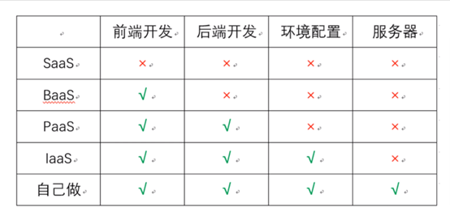
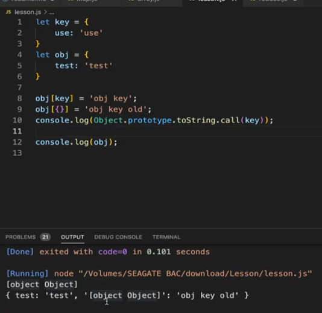
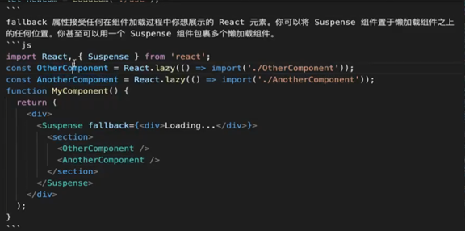
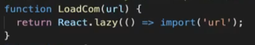
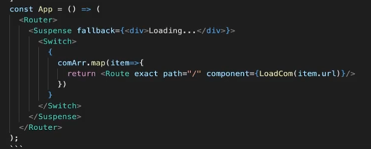

# 今日工作：

## 和谭涛键老师去SK:

请教了一些公司和技术相关问题：微服务是什么，红皮书如何获取

微服务：微服务是一种软件架构风格，其中一个大型应用程序被拆分成一组小型、独立的服务，这些服务都可以独立部署和扩展。每个服务都运行在自己的进程中，有自己的数据库和 API，并通过轻量级通信机制（如 HTTP）与其他服务进行交互。

如时间线服务，消息服务，用户服务

红皮书在友乐学上下载

## 和潘树芝老师讨论richl-web的问题：

经过商讨，我们还是决定把原框架的class声明组件改为function声明组件，原因如下：

官方推荐使用function声明

Function声明可以使用到所有React版本稳定后的特性，但class声明要想实现这些功能，需要大量的外部依赖

潘树芝老师也是使用function声明，同时function声明更利于测试

后期开发，如果组件间传递数据过于复杂，需要引入redux时，function有更好的对数据传输的支持

在友乐学2021新春客开赋能课程中，讲师推荐使用function声明

解决方案：

1. 删除‘render()’，改用return
2. 所有‘this.props‘和相关参数改成props,所有类内函数加def
3. 删除constructor()方法,将里面的内容移出
4. 将this.state改为useState()中的用法
5. 删除所有componentWillUpdate(),componentDidUpdate(), shouldComponentUpdate(),改用useRef(), useEffect()

## 阿里巴巴Java编程规范:

1. 反序列化（Deserialization）是指将序列化后的数据（即将数据转换为特定格式以便于在网络或磁盘上传输或存储）恢复成原始的对象或数据结构的过程。
2. 使用索引访问用
   String 的 split 方法得到的数组时，需做最后一个分隔符后有无内容的检查，否则会有抛
   IndexOutOfBoundsException 的风险。说明：

```
String str = "a,b,c,,";
String[] ary = str.split(","); // 预期大于 3，结果等于 3
System.out.println(ary.length);
```


3. final 可以声明类、成员变量、方法、以及本地变量，下列情况使用
   final 关键字： 1）不允许被继承的类，如：String 类。 2）不允许修改引用的域对象，如：POJO
   类的域变量。 3）不允许被覆写的方法，如：POJO 类的 setter 方法。
   4）不允许运行过程中重新赋值的局部变量。
   5）避免上下文重复使用一个变量，使用
   final 关键字可以强制重新定义一个变量，方便更好地进行重构。
4. 循环体内，字符串的连接方式，使用
   StringBuilder 的 append
   方法进行扩展。如：

```
StringBuilder sb = new StringBuilder();
for (int i = 0; i < 10; i++) {
sb.append("Number: ").append(i).append("\n");
}
String result = sb.toString();
System.out.println(result);
```


5. 关于
   hashCode 和 equals
   的处理，遵循如下规则：
   1）只要覆写equals，就必须覆写hashCode。 2）因为 Set 存储的是不重复的对象，依据 hashCode 和equals 进行判断，所以Set 存储的对象必须覆写这两种方法。
   3）如果自定义对象作为Map 的键，那么必须覆写hashCode 和 equals。说明：String 因为覆写了 hashCode 和equals 方法，所以可以愉快地将
   String 对象作为 key来使用。
6. 判断所有集合内部的元素是否为空，使用isEmpty() 方法，而不是size() == 0 的方式。
7. 使用Map 的方法keySet() / values() / entrySet() 返回集合对象时，不可以对其进行添加元素操作：

```
int[] nums = {1, 2, 3, 4, 5, 6};
```

```
List<Integer> evenNums =Arrays.stream(nums).filter(n ->n % 2 == 0).boxed().collect(Collectors.toList());
```

8. 使用集合转数组的方法，必须使用集合的
   toArray(T[] array)，传入的是类型完全一致、长度为
   0 的空数组。
9. 泛型通配符来接收返回的数据，此写法的泛型集合不能使用
   add 方法，而不能使用
   get 方法，两者在接口调用赋值的场景中容易出错。

①  `List<? extends Number>`表示这个 `List`可以包含任何继承自 `Number`类的对象，比如 `Integer`、`Double`等

②  `List<? super Integer>`表示这个 `List`可以包含任何 `Integer`或者 `Integer`的父类对象。

10. 在无泛型限制定义的集合赋值给泛型限制的集合时，在使用集合元素时，需要进行
    instanceof 判断，避免抛出ClassCastException 异常。

## 学习YonBIP开发者社区

### 1.   YonBuider基础知识

### 云计算三大服务平台：

IaaS（基础设施即服务）：IaaS是一种云计算服务，它为用户提供了虚拟化的计算资源（如服务器、存储、网络等），用户可以通过云服务提供商的管理控制面板来管理和部署自己的应用程序、操作系统和数据等。IaaS适用于那些需要管理自己的操作系统、网络和应用程序的企业，它可以提供更高的灵活性和可定制性。

PaaS（平台即服务）：PaaS是一种云计算服务，它为用户提供了一个平台来构建、部署和运行应用程序，用户可以使用预定义的开发工具和语言来开发和测试自己的应用程序，同时也可以轻松地管理和扩展应用程序的资源。PaaS适用于那些需要快速开发和部署应用程序的企业，它可以减少应用程序的部署时间和成本。

SaaS（软件即服务）：SaaS是一种云计算服务，它为用户提供了一个完整的应用程序，用户可以通过互联网来访问和使用该应用程序，而无需安装或维护自己的软件和硬件设备。SaaS适用于那些需要简单易用的应用程序的企业，它可以提供更低的部署和维护成本，同时也可以随时随地访问应用程序。

BaaS（区块链即服务）：是一种将区块链技术作为服务提供给开发者的模式。BaaS提供的服务包括区块链网络架构、节点管理、智能合约开发工具、数据存储和安全等方面的支持。BaaS还提供了多种区块链平台的选择，包括以太坊、Hyperledger
Fabric等，这使得开发者可以选择最适合他们需求的平台来构建应用程序。



### 2.   友乐学学习：

我发现友乐学上很多视频都没有进度条，许多学员在评论区抱怨，因此我写了一个简单的脚本，可以调整视频进度和播放速度:

[https://github.com/princepride/You-Lexue-Script](https://github.com/princepride/You-Lexue-Script)

## 友乐学2021新春客开赋能课程:

1.debugger关键词的用处:运行时开启debug模式

2.当用一个对象作为键时，将会调用toString方法将其转化为string.

以对象作为键值会直接覆盖原有对象



3.懒加载和loading的中间件：



 ***推荐的基于懒加载的路由写法**(***  ***提升页面加载速度)*** :





# 明日展望：

1. 继续看完友乐学2021新春客开赋能课程，这门课非常不错，从源码解读React框架和机制，同时介绍React编写程序的规范
2. 继续看YonBIP课程
3. 继续看阿里巴巴java编程规范
