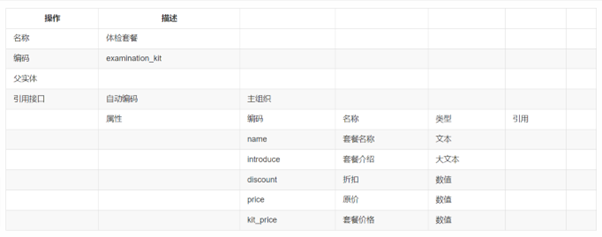
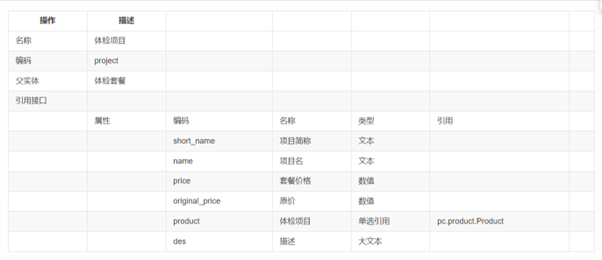
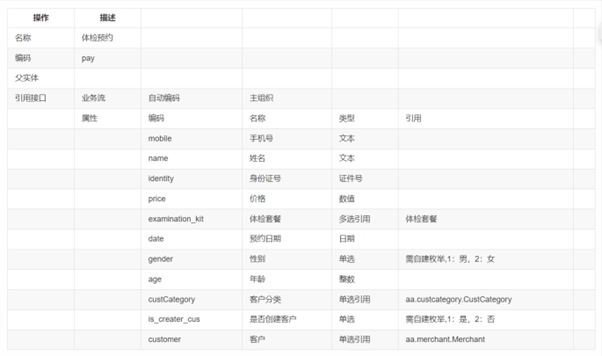
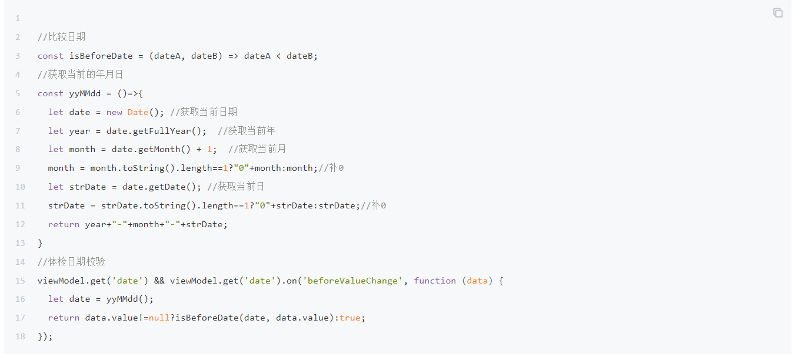

今日工作：

测试mingwa_WK_0526_SO本币金额取净价计算

测试mingwa_WK_0526_价目表导入报价单增行

测试patch_20230525192241销售发票审批报错

测试patch_20230526002912采购入库回写采购订单开票关闭

测试patch_20230526003948采购退货不生成销售出库

测试patch_20230526095514AR传EAS工单

测试patch_20230526103807AR传EAS子查询报错

测试patch_20230526110401PUSHTOPO核心逻辑

测试patch_20230526111001明华PO审批开票开启

测试patch_20230526150422EAS主数据

测试patch_mingwa_JM_SOSQ_TBQ

测试patch_mingwa_JM_SOSQ_合并

继续看视频课程：开发案例-体检管理，跟着做，接昨天的笔记

·
业务单元（新建《其他组织》，编码《test0001》，名称《测试专用》,下面勾选：人力资源组织，销售组织，采购组织，库存组织，会计主体，点击保存，点击期初设置，设置时间）

·
授权（在右边栏点击分配组织权限，勾选test0001测试专用）

·
基础数据分级管理

-> 客户分类->档案管理权限勾选测试专用

->客户->档案管理权限勾选测试专用

->物料->档案管理权限勾选测试专用

->物料分类->档案管理权限勾选测试专用->

·
客户分类->使用组织填写：测试专用

->点击新增->管理组织选择：测试专用，分类编码：0001，分类名称：一般会员->保存

->点击新增->管理组织选择：测试专用，分类编码：0001，分类名称：会员->保存

·
物料分类->使用组织填写：测试专用

->点击新增->管理组织选择：测试专用，分类编码：0001，分类名称：体检耗用->保存

->点击新增->管理组织选择：测试专用，分类编码：0001，分类名称：体检套餐->保存

->点击新增->管理组织选择：测试专用，分类编码：0001，分类名称：体检项目->保存

·
计量单位

->云端导入：MTR，DMT，CMT，套->点击左侧:Length长度->新增->编码：002，名称：根，分组：长度->保存

·
物料创建

选择体检耗用

->新增->物料名称：针管->计量单位->使用物料自己的计量单位->选择根

->新增->物料名称：胶带->计量单位->使用物料自己的计量单位->选择厘米

选择体检套餐

->新增->物料名称：一般套餐->计量单位->使用物料自己的计量单位->选择套

->新增->物料名称：高级套餐->计量单位->使用物料自己的计量单位->选择套

选择体检项目

->新增->物料名称：常规检查->计量单位->使用物料自己的计量单位->选择套

->新增->物料名称：内科->计量单位->使用物料自己的计量单位->选择套

·
交易类型

销售服务->销售管理->销售订单->新增

交易类型->交易类型编码:SQ0001T,交易类型名称:体检->保存

·
仓库

->新增->仓库名称：倪仓->业务信息库存组织:选择test0001，点击确定管理组织：测试专用->点击保存

·
其他入库->新增（空白单据）

表头：->仓库：倪仓

表体：->物料编码->选择体检耗用下的全部内容->数量:10000->点击保存

·
（测试）其他入库->新增（空白单据）

表体：->物料编码->选择体检耗用下的全部内容->数量:2->点击保存->点击审核（若审核通过，说明其他入库创建成功）

·
客户档案

左侧选择一般会员->新增->客户名称：测试客户->客户分类：一般会员->保存

·
销售订单->新增（手工新增）

表头->客户：选择测试客户，交易类型：订单开票->确认

表体->选择：高级套餐计价数量：12，含税成交价：xxx，税率：xxx->保存->审核

（测试）下推->销售发票->保存点击联查（联查成功，说明配置正确）

·
应用构建->新建应用->应用名称：体检管理，所属领域：测试培训专用->点击完成

·
对象建模

->新建业务对象->参照下表（编码需唯一，系统属性抄引用接口，业务属性抄属性）



保存

在体检套餐下点击添加子实体，还是参照下表：



保存

在体检项目下点击添加子实体，还是参照下表：


·
页面建模：主子孙

页面名称：体检套餐

元数据：体检套餐

->点击保存

分别选择主子孙表->特性配置->字段配置->调整字段顺序

->体检套餐->原价->设置公式->聚合函数->sum(list, “express”)

List选变量中的体检项目，express选原价


->体检套餐->套餐价格->设置公式->聚合函数->sum(list, “express”)

List选变量中的体检项目，express选套餐价格

->体检套餐->折扣->设置公式->套餐价格/原价

->体检套餐->设置主表折扣、套餐价格、原价不允许修改

->体检项目->右边选择参照带入->参照配置->新增一行（将参照**物料名称**带入到 **项目名** ）

->数据过滤->**物料分类**等于常量**体检项目**

->右侧依次设置子表体检项目、项目名、套餐价格、原价必填

->孙表物料配置参照带入，将参照的计量单位带入当前页面的计量单位，并配置参照过滤，只显示物料分类为体检耗用的数据

（测试）

新增->体检套餐   组织：测试专用  套餐名称：测试套餐

->体检项目
 增行->依次填写：体检项目，套餐价格，原价

->检查耗用品
->增行->填写物料，使用数量

->保存

如果想改颜色:

单据设计->对应节点->编码->”bJointQuery”:false
->保存

体检预约：

对象建模

->新增->名称：体检预约，具体参照下表：



（注意在枚举管理中创建枚举）

->新增->名称：检测项目，具体参照下表：


页面建模->参照->新建参照->表参照->下一步->元数据：体检套餐（用户），页面名称：体检套餐参照->完成

页面建模->参照->新建参照->表参照->下一步->元数据：体检项目（用户），页面名称：体检项目参照->完成

页面建模->页面->左侧选择体检预约->新建页面->一主多子->下一步->元数据：体检预约，页面编码：pay，页面名称：体检预约->完成

单据设计->右边点击字段设置->调整字段顺序

点击右侧，设置必填项：

体检中心、客户分类、手机号、姓名、身份证号、预约时间

配置公式

身份证号带出年龄和性别，点击右侧

年龄公式：

strToNum(dateFormat(sysdate(),"yyyy"))-strToNum(substring(identity,32,35))

性别公式：
iif(contains("013579",substring(identity,42,42)),"1","2")

设置性别，年龄，是否创建客户，客户->允许修改：否->保存

设置是否创建客户->默认值：否

配置公式

主表价格等于子表使用价格合计

价格：sum(pre_projectList,"pre_projectList.useprice")

设置性别，年龄，是否创建客户，客户->允许修改：否->保存

体检项目：

设置体检项目、物料、所属套餐、原价、套餐价格、是否套餐、使用金额->允许修改：否->保存

层级->右侧->动作

预约日期->值改变前：



->保存

增加交互，主表选择套餐后带出体检项目至子表

层级->体检预约详情->动作->页面初始化->编辑脚本

（体检套餐是多选引用，名称要从 **实体清单** **->点击右侧->子表集合属性**来找）

```
明日展望：//选择套餐后自动带出体检项目
```

```
viewModel.get("pay_examination_kitList").on("afterValueChange",function(data){
```

```
  //获取当前的表格模型
```

```
  let gridModel = viewModel.get("pre_projectList");
```

```
  //清楚子表是否套餐为是的行，后续再进行新增
```

```
  clearKitRow();
```

```
  //判断只有一个套餐还是删除的情况下对套餐字段进行清空
```

```
  if(data!=null&&data!=undefined&&data.valueState!=undefined&&data.valueState.length==1&&data.valueState[0]=="Delete"){
```

```
    viewModel.get("pay_examination_kitList").clear();
```

```
    returntrue;
```

```
  }
```

```
  //重新对套餐字段进行赋值操作
```

```
  viewModel.get("pay_examination_kitList").clear();
```

```
    let kits = [];
```

```
    data.value.forEach((kit,index)=>{
```

```
      //如果没有这两个属性，说明需要重新拼值
```

```
      if(!(kit.hasOwnProperty("examination_kit")&&kit.hasOwnProperty("pay_examination_kitList"))){
```

```
        kit.examination_kit = kit.id;
```

```
        kit.pay_examination_kitList = kit.name;
```

```
      }
```

```
      if(data.valueState!=undefined&&data.valueState[index]!=undefined&&data.valueState[index]!="Delete"){
```

```
        kits.push(kit);
```

```
      }
```

```
      if(data.valueState==undefined){
```

```
        kits.push(kit);
```

```
      }
```

```
  })
```

```
  viewModel.get("pay_examination_kitList").setData(kits);
```

```
  //如果套餐字段还有数据则调用接口获取项目后渲染页面
```

```
  if(data!=null&&data!=undefined&&data.value.length>0){
```

```
    let result = cb.rest.invokeFunction("AT1772AFF21C18000A.api.getProInfoById", {data:kits},
```

```
            function(err, res) {
```

```
              if(err!=undefined||err!=null){
```

```
                cb.utils.alert("获取套餐异常");
```

```
                returnfalse;
```

```
              }
```

```
            },viewModel, {async:false});
```

```
    result.result.res.forEach((project)=>{
```

```
      project.is_kit=1;
```

```
      gridModel.appendRow(project);//插入行
```

```
    })
```

```
  }
```

```

```

```
})
```

```
//清楚所有套餐行
```

```
const clearKitRow = ()=>{
```

```
  let gridModel = viewModel.get("pre_projectList");
```

```
  let rows = gridModel.getRows();//获取表格所有的行
```

```
  let deleteRowIndexes = [];
```

```
  rows.forEach((row,index)=>{
```

```
    if(row.is_kit=="1"){
```

```
      deleteRowIndexes.push(index);
```

```
    }
```

```
  })
```

```
  gridModel.deleteRows(deleteRowIndexes);
```

```
}
```

 **F12->**  **源代码->**  **打开文件->hpa** **（可以找到脚本的源代码）**

今天学的内容：

增加交互，点击增行按钮弹出体检项目选择后带入父页面

1）、体检项目创建列表页面命名为体检项目弹框

2）、添加页面数据调整为模态框，"templateType":
"modal", 并更改弹框宽度为1000

3）、增加底部栏按钮，命名为确定、取消

4）、确定按钮绑定函数

```
viewModel.get('button2ai') && viewModel.get('button2ai').on('click', function (data) {
```

```
  // 确定--单击
```

```
  let selectedRows = viewModel.getGridModel().getSelectedRows();
```

```
  if(selectedRows.length==0){
```

```
    cb.utils.alert("请选择数据");
```

```
    returnfalse;
```

```
  }
```

```
  var parentViewModel = viewModel.getCache('parentViewModel'); //模态框中获取父页面
```

```
  var gridModel = parentViewModel.getGridModel();
```

```
  selectedRows.forEach((row)=>{
```

```
    row.is_kit="2";
```

```
    row.project_name = row.name;
```

```
    row.project = row.id;
```

```
    row.product_standard = row.product;
```

```
    row.product_standard_name = row.product_name;   
```

```
    gridModel.appendRow(row);
```

```
  })
```

```
  //关闭模态框
```

```
  viewModel.communication({type:'modal',payload:{data:false}});
```

```
});
```

5)、取消按钮绑定动作取消

6)、回到体检预约详情页面，点击增行，添加函数

```
// 增行--单击,弹出模态框
```

```
viewModel.get('btnAddRowpre_project') && viewModel.get('btnAddRowpre_project').on('click', function (params) {
```

```
  let data = {
```

```
        billtype: 'VoucherList',// 单据类型
```

```
        billno: 'examination_kit_project'// 单据号
```

```
  };
```

```
  //打开一个单据，并在当前页面显示
```

```
  cb.loader.runCommandLine('bill', data, viewModel);
```

```
});
```

增加交互，选择子表行，点击删行按钮删除子表数据,不符合套餐的情况跟新主表套餐

```
// 删行--单击
```

```
viewModel.get('btnBatchDeleteRowpre_project') && viewModel.get('btnBatchDeleteRowpre_project').on('click', function (data) {
```

```
  var belongKitId = [];
```

```
  var belongKitMap = [];
```

```
  var gridModel = viewModel.get("pre_projectList");
```

```
  var selectedRowIndexes = gridModel.getSelectedRowIndexes();//获取选中的行号
```

```
  if(selectedRowIndexes.length>0){
```

```
    //获取删除行所属套餐
```

```
    selectedRowIndexes.forEach((row)=>{
```

```
      let currentRow = gridModel.getRow(row);//获取指定行数据
```

```
      if(currentRow.examination_kit!=undefined&&currentRow.examination_kit!=null&&currentRow.is_kit=="1"){
```

```
        belongKitId.push(currentRow.examination_kit);
```

```
        belongKitMap[currentRow.examination_kit]=currentRow.is_kit;
```

```
      }
```

```
    })
```

```
  }else{
```

```
    cb.utils.alert("请选择数据");
```

```
    returnfalse;
```

```
  }
```

```
  cb.utils.confirm("删除后不满足套餐的情况体检项将按照原价计算",function(){
```

```
    //先删除选中行
```

```
    gridModel.deleteRows(selectedRowIndexes);
```

```
    //获取表格信息，根据当前删除行的所属套餐改变是否套餐为否;
```

```
    gridModel.getRows().forEach((row,rowIndex)=>{
```

```
      if(belongKitMap.hasOwnProperty(row.examination_kit)){
```

```
        gridModel.setCellValue(rowIndex, "is_kit", "2",true);
```

```
      }
```

```
    })
```

```
    //删除主表字段中的套餐,
```

```
    var kits = viewModel.get("pay_examination_kitList").getValue();
```

```
    var newKit = [];
```

```
    kits.forEach((kit,index)=>{
```

```
      if(!(belongKitMap.hasOwnProperty(kit.examination_kit)&&belongKitMap[kit.examination_kit]=="1")){
```

```
        newKit.push(kit);
```

```
      }
```

```
    })
```

```
    viewModel.get("pay_examination_kitList").clear();
```

```
    if(newKit.length>0){
```

```
        //重新赋值
```

```
        viewModel.get("pay_examination_kitList").setData(newKit);  
```

```
    }
```

```
  })
```

```
});
```

保存按钮增加规则，新增后端脚本调用开放平台接口插入预约人信息客户档案

1)、增加后端脚本配置文件

```
let AbstractTrigger = require('AbstractTrigger');
```

```
  classMyTriggerextendsAbstractTrigger{
```

```
    execute(context,param){
```

```
      let data = {
```

```
        "appcode":"AT1772AFF21C18000A",
```

```
        "apiurl":{
```

```
            "customer":"https://dbox.diwork.com/iuap-api-gateway/yonbip/digitalModel/merchant/save",
```

```
            "apilog":"https://dbox.diwork.com/iuap-api-gateway/rybentc5/testapifun01/testapifun01p/apilog",
```

```
            "othoutrecord":"https://dbox.diwork.com/iuap-api-gateway/yonbip/scm/othoutrecord/single/save"
```

```
        }
```

```
      }
```

```
      let apiurl
```

```
      if(context==null){
```

```
        apiurl = data["apiurl"];
```

```
      }else{
```

```
        apiurl = data["apiurl"][context];
```

```
      }
```

```
      return {"appcode":data.appcode,"apiurl":apiurl};
```

```
    }
```

```
  }
```

```
  exports({"entryPoint":MyTrigger});
```

2)、增加日志业务对象用于记录异常日志

根据业务对象创建列表页面,用于查看日志信息

3)、创建日志记录后端脚本

```
let AbstractAPIHandler = require('AbstractAPIHandler');
```

```
  classMyAPIHandlerextendsAbstractAPIHandler{
```

```
   execute(request){
```

```
    var error = {reqparams:request.body,response:request.apiResponse,action:request.apiAction,billnum:request.billnum,excute_date:request.createTime};
```

```
    ObjectStore.insert("AT1772AFF21C18000A.AT1772AFF21C18000A.errlog",error,"errlog");
```

```
   return {};
```

```
 }
```

```
}
```

```
exports({"entryPoint":MyAPIHandler});
```

4)、调用客户档案接口

```
let AbstractTrigger = require('AbstractTrigger');
```

```
  classMyTriggerextendsAbstractTrigger{
```

```
    execute(context,param){
```

```
      //现在只处理新增客户的情况，还有更新客户的情况暂不考虑
```

```
      let reqParams = param.data[0]; 
```

```
      //如果已经生成客户直接返回
```

```
      if(reqParams.is_creater_cus=="1")return;
```

```
      //如果是更新操作拦截直接返回
```

```
      let pageRequestData = JSON.parse(param.requestData);
```

```
      if(pageRequestData["_status"]==null||pageRequestData["_status"]=="Update")return ;
```

```
      //默认的客户保存JSON传参
```

```
      let body = {"data":{"name":{"zh_CN":"vvvvb345567678999"},"createOrg":"2257324212162816","customerClass":"2264313873323776","_status":"Insert","retailInvestors":false,"enterpriseNature":"0","businessRole":"1","taxPayingCategories":0,"enable":"1","merchantApplyRanges":[{"hasDefaultInit":true,"isApplied":true,"rangeType":1,"_status":"Insert","isCreator":true,"orgId":"2257324212162816"}],"merchantAppliedDetail":{"payway":99},"merchantRole":{"cardType":"0","businessRole":"1","toBImmigrationMode":"0","settlementMethod":"0","_status":"Insert"},"isApplied":true,"autoGenerateRangeData_":true,"isCreator":true}};
```

```
      //替换字段值
```

```
      body.data.code = newDate().getTime()+S4();
```

```
      body.data.name.zh_CN = reqParams.name;
```

```
      body.data.createOrg = reqParams.org_id;
```

```
      body.data.merchantApplyRanges[0].orgId = reqParams.org_id;
```

```
      body.data.customerClass = reqParams.custCategory;
```

```
      //获取接口请求地址信息
```

```
      let apiAction = "customer";
```

```
      let configFun = extrequire("AT1772AFF21C18000A.backend.config");
```

```
      let configRes = configFun.execute(null);
```

```
      let reqType = "POST";
```

```
      var apiResponse = "";
```

```
      try{
```

```
        apiResponse = openLinker(reqType, configRes.apiurl[apiAction], configRes.appcode, JSON.stringify(body));
```

```
        let apiResponseData = JSON.parse(apiResponse);
```

```
        if(apiResponseData.code!=200){
```

```
          thrownewError("日志处理");
```

```
        }else{
```

```
          //更新是否创建用户为是
```

```
          var updateIsCreater = {id:reqParams.id,is_creater_cus:"1",customer:apiResponseData.data.id};
```

```
          ObjectStore.updateById("AT1772AFF21C18000A.AT1772AFF21C18000A.pay",updateIsCreater,"pay");
```

```
        }
```

```
      }catch(e){
```

```
        //处理日志,调用接口是避免回滚
```

```
        var error = {body:JSON.stringify(body),apiResponse:apiResponse,apiAction:apiAction,billnum:"examination_kit",createTime:reqParams.createTime};
```

```
        openLinker(reqType, configRes.apiurl["apilog"], configRes.appcode, JSON.stringify(error));
```

```
        thrownewError("生成客户失败,请检查");
```

```
      }
```

```
     return {};
```

```
    }
```

```
  }
```

```
  exports({"entryPoint":MyTrigger});
```

展望：

1.周末研究用YonBIP做sccci项目（暂时不包括手机端）
