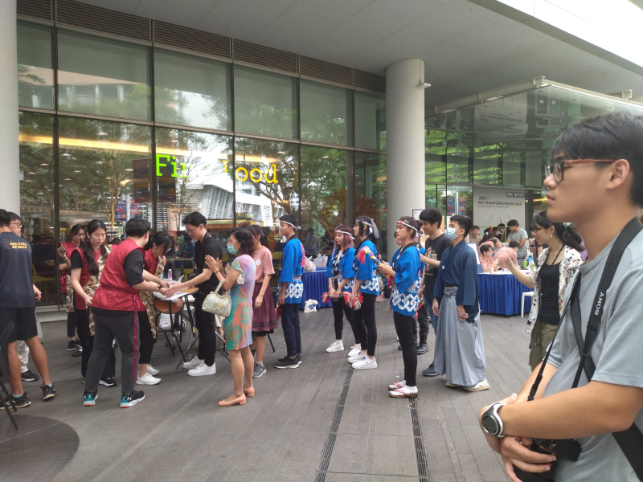
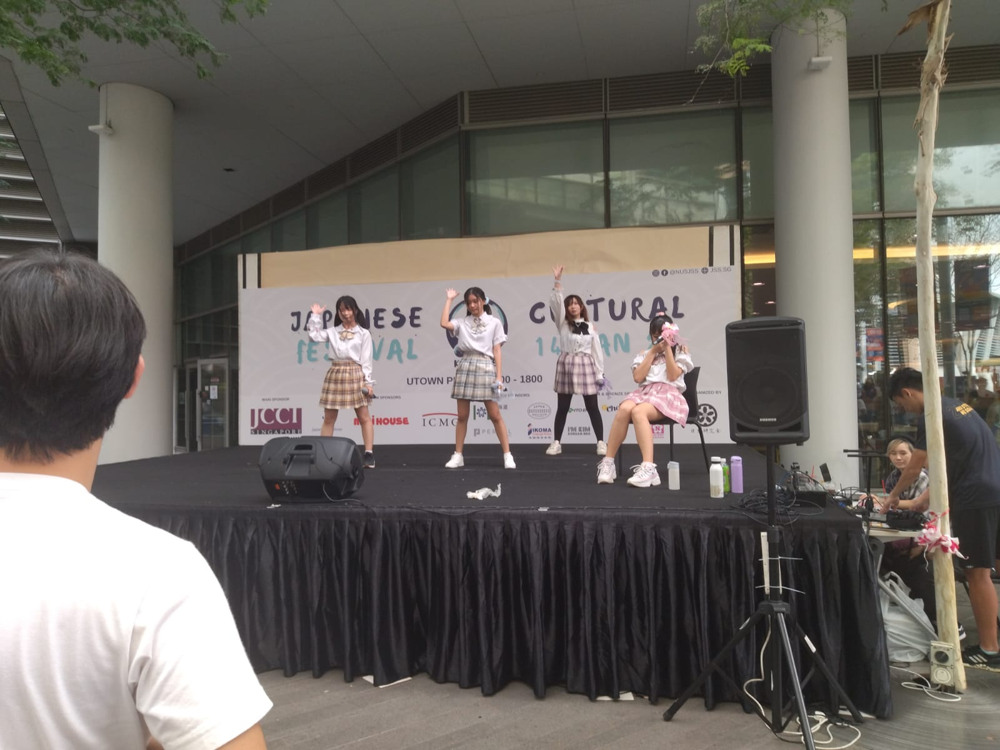

# Japanese Cultural Festival Travel Notes

Today, our NUS have a Japanese cultural festival, there are so many performance.

Here is the waiting people:

Here is the girl's show:

What inspired me most is that the girls feel confidence event if their performance don't perfect. I believe that must be the ***culture shock***. In China, you can't go to stage even if it is a small event, even if you are good but not perfect.

Our group talked a lot about the culture difference between China and The West. Why Chinese always have to work much harder then other country people but have to suffer much more difficulties?
