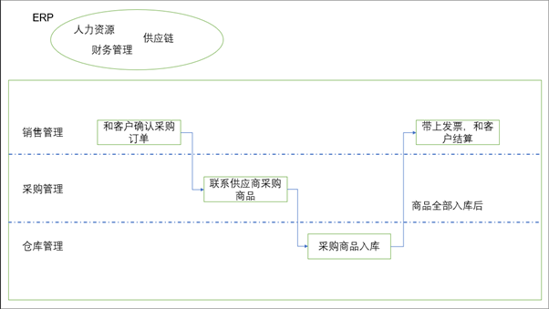
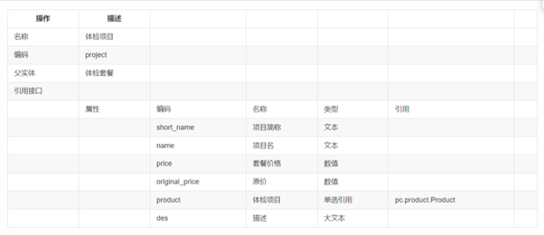
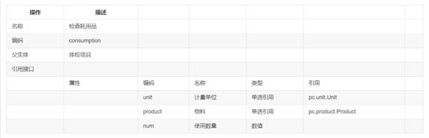
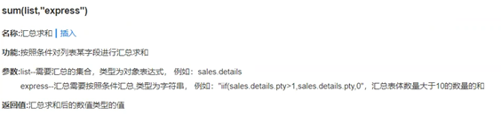

今日工作：

火灾演习期间请教Thomas老师，了解整体业务流程

2.测试mingwa_WK_0523_PO发送邮件报错补丁

3.测试patch_20230523190616服务类物料不过滤

4.测试patch_20230523205302SO审批以后更新价目表vbdef2122

5. 测试patch_20230524114103SOPoragancy
   表体供应商编辑不自动带出币种

6.测试PATCH_ARAP_NCC2005_应收单收款单录入节点支持提交收回

9.看视频课程：开发案例-体检管理，跟着做

·
业务单元（新建《其他组织》，编码《test0001》，名称《测试专用》,下面勾选：人力资源组织，销售组织，采购组织，库存组织，会计主体，点击保存，点击期初设置，设置时间）

·
授权（在右边栏点击分配组织权限，勾选test0001测试专用）

·
基础数据分级管理

-> 客户分类->档案管理权限勾选测试专用

->客户->档案管理权限勾选测试专用

->物料->档案管理权限勾选测试专用

->物料分类->档案管理权限勾选测试专用->

·
客户分类->使用组织填写：测试专用

->点击新增->管理组织选择：测试专用，分类编码：0001，分类名称：一般会员->保存

->点击新增->管理组织选择：测试专用，分类编码：0001，分类名称：会员->保存

·
物料分类->使用组织填写：测试专用

->点击新增->管理组织选择：测试专用，分类编码：0001，分类名称：体检耗用->保存

->点击新增->管理组织选择：测试专用，分类编码：0001，分类名称：体检套餐->保存

->点击新增->管理组织选择：测试专用，分类编码：0001，分类名称：体检项目->保存

·
计量单位

->云端导入：MTR，DMT，CMT，套->点击左侧:Length长度->新增->编码：002，名称：根，分组：长度->保存

·
物料创建

选择体检耗用

->新增->物料名称：针管->计量单位->使用物料自己的计量单位->选择根

->新增->物料名称：胶带->计量单位->使用物料自己的计量单位->选择厘米

选择体检套餐

->新增->物料名称：一般套餐->计量单位->使用物料自己的计量单位->选择套

->新增->物料名称：高级套餐->计量单位->使用物料自己的计量单位->选择套

选择体检项目

->新增->物料名称：常规检查->计量单位->使用物料自己的计量单位->选择套

->新增->物料名称：内科->计量单位->使用物料自己的计量单位->选择套

·
交易类型

销售服务->销售管理->销售订单->新增

交易类型->交易类型编码:SQ0001T,交易类型名称:体检->保存

·
仓库

->新增->仓库名称：倪仓->业务信息库存组织:选择test0001，点击确定管理组织：测试专用->点击保存

·
其他入库->新增（空白单据）

表头：->仓库：倪仓

表体：->物料编码->选择体检耗用下的全部内容->数量:10000->点击保存

·
（测试）其他入库->新增（空白单据）

表体：->物料编码->选择体检耗用下的全部内容->数量:2->点击保存->点击审核（若审核通过，说明其他入库创建成功）

·
客户档案

左侧选择一般会员->新增->客户名称：测试客户->客户分类：一般会员->保存

·
销售订单->新增（手工新增）

表头->客户：选择测试客户，交易类型：订单开票->确认

表体->选择：高级套餐计价数量：12，含税成交价：xxx，税率：xxx->保存->审核

（测试）下推->销售发票->保存点击联查（联查成功，说明配置正确）

·
应用构建->新建应用->应用名称：体检管理，所属领域：测试培训专用->点击完成

·
对象建模

->新建业务对象->参照下表（编码需唯一，系统属性抄引用接口，业务属性抄属性）

保存

在体检套餐下点击添加子实体，还是参照下表：

保存

在体检项目下点击添加子实体，还是参照下表：

·
页面建模：主子孙

页面名称：体检套餐

元数据：体检套餐

->点击保存

分别选择主子孙表->特性配置->字段配置->调整字段顺序

->体检套餐->原价->设置公式->聚合函数->sum(list,
“express”)

List选变量中的体检项目，express选原价

->体检套餐->套餐价格->设置公式->聚合函数->sum(list,
“express”)

List选变量中的体检项目，express选套餐价格

->体检套餐->折扣->设置公式->套餐价格/原价

->体检套餐->设置主表折扣、套餐价格、原价不允许修改

->体检项目->右边选择参照带入->参照配置->新增一行（将参照**物料名称**带入到 **项目名** ）

->数据过滤->**物料分类**等于常量**体检项目**

->右侧依次设置子表体检项目、项目名、套餐价格、原价必填

->孙表物料配置参照带入，将参照的计量单位带入当前页面的计量单位，并配置参照过滤，只显示物料分类为体检耗用的数据

明日展望：

1.继续看视频课程

2.继续测试
