# 今日工作：

## 编写React代码转换器

①  实现文件夹遍历，记录文件结构，依据后缀标记目标文件

## Spring Boot 学习

学习JPA和JDBC的用法

`CommandLineRunner`接口是Spring Boot框架中的一个接口，它定义了一个 `run`方法，当Spring Boot应用程序启动时，这个 `run`方法会被自动调用。开发人员可以通过实现 `CommandLineRunner`接口来编写一些在应用程序启动时需要执行的初始化逻辑，例如加载数据、初始化缓存、创建线程等。

如

```
@Bean
public CommandLineRunner CommandLineRunner(String[] args) {   
	return runner -> {   
		System. out .println("Hello World");   
	};
}
```


@Entity

@Table(name="student")

这段代码是
Java Persistence API (JPA) 中用来定义实体类映射到数据库表的注解。`@Entity`注解表示这个类是一个实体类，将会被持久化到数据库中。`@Table(name="student")`指定了这个实体类映射到数据库中的表名为
"student"。这意味着这个实体类中的属性将会被映射到数据库表中的对应列中。

@Id

@GeneratedValue(strategy= GenerationType.IDENTITY) @Column(name="id")

`@Id`注解表示该属性是实体类对应表的主键。

`@GeneratedValue(strategy = GenerationType.IDENTITY)`注解指定了如何生成主键。自增

`@Column(name="id")`注解指定了该属性映射到数据库表中的列名为"id"。

DAO是指数据访问对象（Data Access Object），是一种设计模式，用于将数据存取逻辑与业务逻辑分离。DAO的主要作用是在应用程序和数据存储之间建立一个抽象层，以便在两者之间进行交互。

`@Repository`是一种注解，用于标注数据访问对象（DAO）类。它的作用是将DAO类标记为Spring Bean，以便在应用程序中进行依赖注入。

entityManager.persist(theStudent)

用于创建和更新数据库记录

`@Transactional`是Spring框架中的注解，用于声明一个方法或类需要事务支持。它可以保证在执行方法时，如果发生异常或错误，所有对数据库的修改都将回滚到方法执行前的状态。

## 学习2022春训客开课程：

### 典型主子示例开发

    问题1：构建主表没找到表名编码

问题2：构建子表无法选择父实体

问题3：页面建模找不到如何绑定元数据

## 应用发布

    发布管理

    ->分组信息

    ->弹出需要发布的应用，勾选并点击添加

    发布应用

    ->选择添加到的菜单

## 应用管理

    系统管理->应用管理->我的应用

## 权限配置

    数字化建模->权限管理->角色管理,授权

## YonBIP开发框架原理

    问题1：元数据引擎分层，是按存储类别还是从属关系分层的？

总体架构

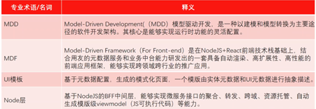

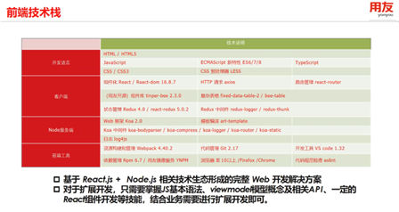

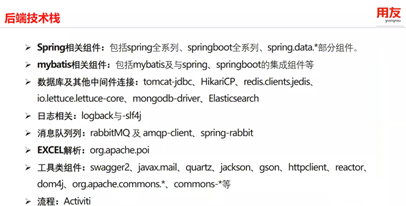

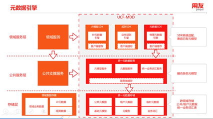

数据模型

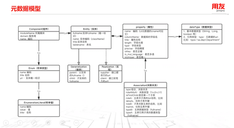

用xml文件存储这些数据的从属关系

UI模板

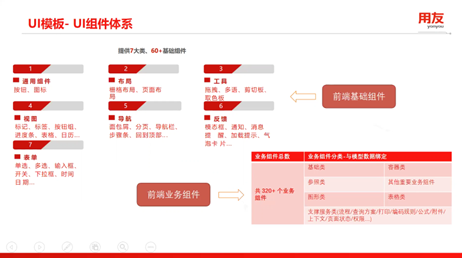

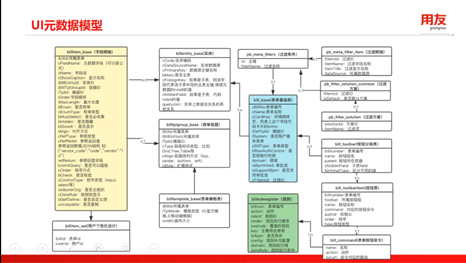

前后端函数

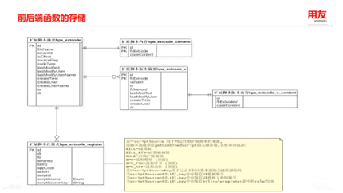

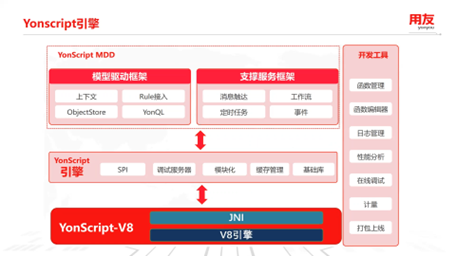

后端脚本和api脚本机制完全不同

    后端脚本是一个Java类，继承自一个抽象类(Spring)

    而api脚本是基于Node.js开发的(Express.js)

规则引擎

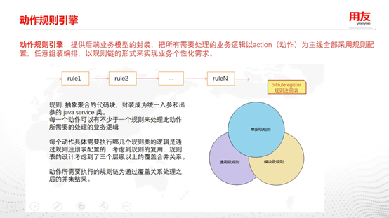

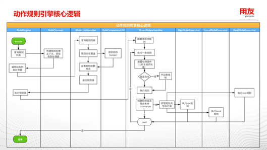

流程模型

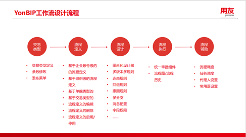

页面加载过程

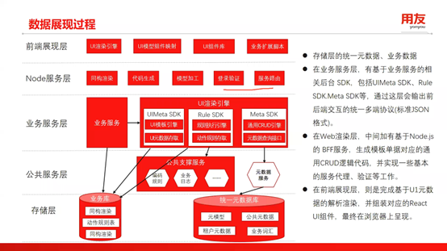

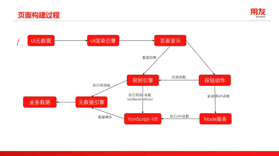

明日展望：

继续学习2022春训客开课程

继续实现代码转换器，实现文件内依据关键词划分类，函数，和变量

继续学习Spring
Boot框架
