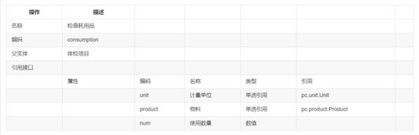
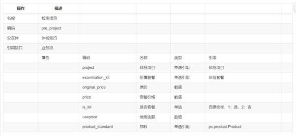

今日工作：

测试patch_20230517233627采购发票允许变更物料

测试patch_20230525091126客商主数据传EAS

测试patch_20230525111631不过滤服务类系列2

测试patch_20230525134744EAS主数据

测试patch_20230525164728不过滤费用类系列3

测试patch_20230525171524EAS主数据

测试PATCH_ARAP_NCC2005_收付单据录入节点支持提交收回0525

测试patch_mingwa_JM_SOSQ_SN341

测试patch_20230524114103SOPoragancy
表体供应商编辑不自动带出币种

测试PATCH_ARAP_NCC2005_应收单收款单录入节点支持提交收回

继续看视频课程：开发案例-体检管理，跟着做，接昨天的笔记

·
业务单元（新建《其他组织》，编码《test0001》，名称《测试专用》,下面勾选：人力资源组织，销售组织，采购组织，库存组织，会计主体，点击保存，点击期初设置，设置时间）

·
授权（在右边栏点击分配组织权限，勾选test0001测试专用）

·
基础数据分级管理

-> 客户分类->档案管理权限勾选测试专用

->客户->档案管理权限勾选测试专用

->物料->档案管理权限勾选测试专用

->物料分类->档案管理权限勾选测试专用->

·
客户分类->使用组织填写：测试专用

->点击新增->管理组织选择：测试专用，分类编码：0001，分类名称：一般会员->保存

->点击新增->管理组织选择：测试专用，分类编码：0001，分类名称：会员->保存

·
物料分类->使用组织填写：测试专用

->点击新增->管理组织选择：测试专用，分类编码：0001，分类名称：体检耗用->保存

->点击新增->管理组织选择：测试专用，分类编码：0001，分类名称：体检套餐->保存

->点击新增->管理组织选择：测试专用，分类编码：0001，分类名称：体检项目->保存

·
计量单位

->云端导入：MTR，DMT，CMT，套->点击左侧:Length长度->新增->编码：002，名称：根，分组：长度->保存

·
物料创建

选择体检耗用

->新增->物料名称：针管->计量单位->使用物料自己的计量单位->选择根

->新增->物料名称：胶带->计量单位->使用物料自己的计量单位->选择厘米

选择体检套餐

->新增->物料名称：一般套餐->计量单位->使用物料自己的计量单位->选择套

->新增->物料名称：高级套餐->计量单位->使用物料自己的计量单位->选择套

选择体检项目

->新增->物料名称：常规检查->计量单位->使用物料自己的计量单位->选择套

->新增->物料名称：内科->计量单位->使用物料自己的计量单位->选择套

·
交易类型

销售服务->销售管理->销售订单->新增

交易类型->交易类型编码:SQ0001T,交易类型名称:体检->保存

·
仓库

->新增->仓库名称：倪仓->业务信息库存组织:选择test0001，点击确定管理组织：测试专用->点击保存

·
其他入库->新增（空白单据）

表头：->仓库：倪仓

表体：->物料编码->选择体检耗用下的全部内容->数量:10000->点击保存

·
（测试）其他入库->新增（空白单据）

表体：->物料编码->选择体检耗用下的全部内容->数量:2->点击保存->点击审核（若审核通过，说明其他入库创建成功）

·
客户档案

左侧选择一般会员->新增->客户名称：测试客户->客户分类：一般会员->保存

·
销售订单->新增（手工新增）

表头->客户：选择测试客户，交易类型：订单开票->确认

表体->选择：高级套餐计价数量：12，含税成交价：xxx，税率：xxx->保存->审核

（测试）下推->销售发票->保存点击联查（联查成功，说明配置正确）

·
应用构建->新建应用->应用名称：体检管理，所属领域：测试培训专用->点击完成

·
对象建模

->新建业务对象->参照下表（编码需唯一，系统属性抄引用接口，业务属性抄属性）


保存

在体检套餐下点击添加子实体，还是参照下表：


保存

在体检项目下点击添加子实体，还是参照下表：



·
页面建模：主子孙

页面名称：体检套餐

元数据：体检套餐

->点击保存

分别选择主子孙表->特性配置->字段配置->调整字段顺序

->体检套餐->原价->设置公式->聚合函数->sum(list, “express”)

List选变量中的体检项目，express选原价


->体检套餐->套餐价格->设置公式->聚合函数->sum(list, “express”)

List选变量中的体检项目，express选套餐价格

->体检套餐->折扣->设置公式->套餐价格/原价

->体检套餐->设置主表折扣、套餐价格、原价不允许修改

->体检项目->右边选择参照带入->参照配置->新增一行（将参照**物料名称**带入到 **项目名** ）

->数据过滤->**物料分类**等于常量**体检项目**

->右侧依次设置子表体检项目、项目名、套餐价格、原价必填

->孙表物料配置参照带入，将参照的计量单位带入当前页面的计量单位，并配置参照过滤，只显示物料分类为体检耗用的数据

今天学的内容：

（测试）

新增->体检套餐   组织：测试专用  套餐名称：测试套餐

->体检项目
 增行->依次填写：体检项目，套餐价格，原价

->检查耗用品
->增行->填写物料，使用数量

->保存

如果想改颜色:

单据设计->对应节点->编码->”bJointQuery”:false
->保存

体检预约：

对象建模

->新增->名称：体检预约，具体参照下表：


（注意在枚举管理中创建枚举）

->新增->名称：检测项目，具体参照下表：



页面建模->参照->新建参照->表参照->下一步->元数据：体检套餐（用户），页面名称：体检套餐参照->完成

页面建模->参照->新建参照->表参照->下一步->元数据：体检项目（用户），页面名称：体检项目参照->完成

页面建模->页面->左侧选择体检预约->新建页面->一主多子->下一步->元数据：体检预约，页面编码：pay，页面名称：体检预约->完成

单据设计->右边点击字段设置->调整字段顺序

点击右侧，设置必填项：

体检中心、客户分类、手机号、姓名、身份证号、预约时间

配置公式

身份证号带出年龄和性别，点击右侧

年龄公式：

strToNum(dateFormat(sysdate(),"yyyy"))-strToNum(substring(identity,32,35))

性别公式：
iif(contains("013579",substring(identity,42,42)),"1","2")

设置性别，年龄，是否创建客户，客户->允许修改：否->保存

设置是否创建客户->默认值：否

配置公式

主表价格等于子表使用价格合计

价格：sum(pre_projectList,"pre_projectList.useprice")

设置性别，年龄，是否创建客户，客户->允许修改：否->保存

体检项目：

设置体检项目、物料、所属套餐、原价、套餐价格、是否套餐、使用金额->允许修改：否->保存

层级->右侧->动作

预约日期->值改变前：

```
//比较日期const isBeforeDate = (dateA, dateB) =>
dateA < dateB;//获取当前的年月日const yyMMdd = ()=>{  let date = newDate(); //获取当前日期  let year =
date.getFullYear();  //获取当前年  let month = date.getMonth() +
1;
//获取当前月  month = month.toString().length==1?"0"+month:month;//补0  let strDate = date.getDate();
//获取当前日  strDate = strDate.toString().length==1?"0"+strDate:strDate;//补0  return year+"-"+month+"-"+strDate;}//体检日期校验viewModel.get('date') && viewModel.get('date').on('beforeValueChange', function (data) {  let date = yyMMdd();  return
data.value!=null?isBeforeDate(date, data.value):true;});
```


->保存

增加交互，主表选择套餐后带出体检项目至子表

层级->体检预约详情->动作->页面初始化->编辑脚本

（体检套餐是多选引用，名称要从 **实体清单** **->点击右侧->子表集合属性**来找）

```
//选择套餐后自动带出体检项目
```

```
viewModel.get("pay_examination_kitList").on("afterValueChange",function(data){
```

```
  //获取当前的表格模型
```

```
  let gridModel = viewModel.get("pre_projectList");
```

```
  //清楚子表是否套餐为是的行，后续再进行新增
```

```
  clearKitRow();
```

```
  //判断只有一个套餐还是删除的情况下对套餐字段进行清空
```

```
  if(data!=null&&data!=undefined&&data.valueState!=undefined&&data.valueState.length==1&&data.valueState[0]=="Delete"){
```

```
    viewModel.get("pay_examination_kitList").clear();
```

```
    returntrue;
```

```
  }
```

```
  //重新对套餐字段进行赋值操作
```

```
  viewModel.get("pay_examination_kitList").clear();
```

```
    let kits = [];
```

```
    data.value.forEach((kit,index)=>{
```

```
      //如果没有这两个属性，说明需要重新拼值
```

```
      if(!(kit.hasOwnProperty("examination_kit")&&kit.hasOwnProperty("pay_examination_kitList"))){
```

```
        kit.examination_kit = kit.id;
```

```
        kit.pay_examination_kitList = kit.name;
```

```
      }
```

```
      if(data.valueState!=undefined&&data.valueState[index]!=undefined&&data.valueState[index]!="Delete"){
```

```
        kits.push(kit);
```

```
      }
```

```
      if(data.valueState==undefined){
```

```
        kits.push(kit);
```

```
      }
```

```
  })
```

```
  viewModel.get("pay_examination_kitList").setData(kits);
```

```
  //如果套餐字段还有数据则调用接口获取项目后渲染页面
```

```
  if(data!=null&&data!=undefined&&data.value.length>0){
```

```
    let result = cb.rest.invokeFunction("AT1772AFF21C18000A.api.getProInfoById", {data:kits},
```

```
            function(err, res) {
```

```
              if(err!=undefined||err!=null){
```

```
                cb.utils.alert("获取套餐异常");
```

```
                returnfalse;
```

```
              }
```

```
            },viewModel, {async:false});
```

```
    result.result.res.forEach((project)=>{
```

```
      project.is_kit=1;
```

```
      gridModel.appendRow(project);//插入行
```

```
    })
```

```
  }
```

```

```

```
})
```

```
//清楚所有套餐行
```

```
const clearKitRow = ()=>{
```

```
  let gridModel = viewModel.get("pre_projectList");
```

```
  let rows = gridModel.getRows();//获取表格所有的行
```

```
  let deleteRowIndexes = [];
```

```
  rows.forEach((row,index)=>{
```

```
    if(row.is_kit=="1"){
```

```
      deleteRowIndexes.push(index);
```

```
    }
```

```
  })
```

```
  gridModel.deleteRows(deleteRowIndexes);
```

```
}
```

 **F12->**  **源代码->**  **打开文件->hpa** **（可以找到脚本的源代码）**

1.争取明天把这个视频课程看完，这样周末可以用yonBIP做个项目

2.继续测试
