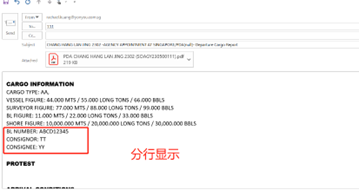

今日工作：

研究YonBIP邮件配置（得多花点时间，因为文档和实际界面改动很大）

配置SCCCI项目excel模板

编辑SCCCI项目界面

测试补丁patch_20230529_附件窗口英文环境操作列加宽

测试补丁patch_20221020153615报表授权200

测试补丁patch_20230528203620GIGRPOSIPI表头自定义项扩展到140

测试补丁patch_20230529164543PUSHTOPO按钮只有审批态可点击

测试补丁patch_20230529173637SO审批PO删行问题

测试补丁patch_20230529193343SQ支持Repair导入导出模板自动Repair文件名

测试补丁patch_20230530075317SO修订删除逻辑&每次修订其他页签不重复逻辑

配合关关演示计时

整理演示过程中遇到的问题

PA-Quotation
SO和SQ排序出错

portlog弹窗不出

stem fig如何没有，remarks不显示bunker
to be stemmed,如果stem
fig如果有，则显示这段话，同时带出值

CARGO information

模板默认值应付款的值

SI发票自带签名章

模板上的英文字数字是错的

SI 的reference
No和date of
Arrival是必填项

reference No取自SO

PDA revision表体和表头页签不同步

明日展望

 配合关关演示计时

整理演示过程中遇到的问题

继续学习YonBIP
